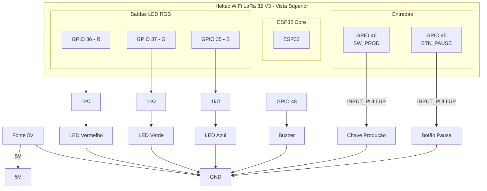

# 🏭 Monitoramento de Produção com Heltec ESP32 V3

Sistema de controle de produção e pausa com envio de dados via TCP

Este projeto utiliza um Heltec V3 para monitorar o ciclo de produção de uma máquina ou posto de trabalho.
Ele contabiliza automaticamente a ordem de produção, tempo de produção, o tempo de pausa, quantidade de pausas e o tempo total, enviando essas informações para um servidor via TCP/IP.

O dispositivo possui:

🚦 LED RGB (VM/VD/AM/AZ) para indicar os status

🔊 Buzzer para sinal sonoro até conexão com servidor e iniciar a contagem de tempo.

🎛️ Chave principal (liga/desliga do ciclo de produção)

⏸️ Botão de pausa

🌐 Envio de dados para servidor SOCKET TCP

## 📌 Funcionalidades

### 🚦 Indicação por LED

- Vermelho fixo → Desconectado do Servidor
- Verde fixo → Aguardando (Conectado)
- Azul fixo → Produzindo (Chave Principal Acionada)
- Amarelo fixo → Pausado

### 🔊 Buzzer

- Bips curtos até conexão com o servidor.
- Um bip curto é emitido ao iniciar o ciclo.

### 🌐 Comunicação

- O módulo se conecta a um Wi-Fi para coletar dados da ordem de produção atual e envia informações para um servidor via SOCKET TCP.

### 📡 Formato do Envio de Dados

O Heltec V3 envia os seguintes campos:

- orderId (ID da Ordem de Produção)
- cycleTime (Tempo do Ciclo de Produção (S))
- pausedTime (Tempo de Pausa durante o ciclo (S))
- quantityProduced (Quantidade Produzida por padrão = 1)
- quantityPaused (Quantidade de Pausas durante o ciclo)

### 🔧 Ligações (Hardware)

### 🚀 Como Usar

1. Configure os dados do Wi-Fi no main.cpp

2. Suba o código no Heltec V3 (PlatformIO recomendado)

3. Execute o servidor TCP na máquina destino (porta 5050 por padrão)

4. Inicie o ciclo com a chave → LED verde piscando

5. Pressione o botão de pausa → LED amarelo piscando

6. Desligue a chave → O heltec envia os tempos automaticamente

