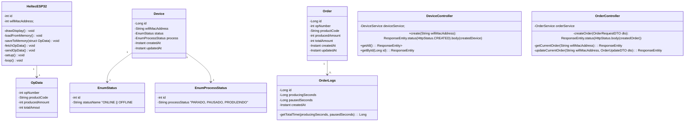

```mermaid

classDiagram
    %% HELTEC ESP32 WIFI + LORA V3 BOARD
    class HeltecESP32{
        -int id
        -int wifiMacAddress;
        -drawDisplay() void
        -loadFromMemory() void
        -saveToMemory(struct OpData) void
        -fetchOpData() void
        -sendOpData() void
        -setup() void
        -loop() void
    }

    class OpData {
        -int opNumber
        -String productCode
        -int producedAmount
        -int totalAmout
    }

    HeltecESP32 "1" --> "1" OpData


    %% SpringBoot Entities
    class Device {
        -Long id
        -String wifiMacAddress
        -EnumStatus status
        -EnumProcessStatus process
        -Instant createdAt
        -Instant updatedAt
    }

    class Order {
        -Long id
        -int opNumber
        -String productCode
        -int producedAmount
        -int totalAmount
        -Instant createdAt
        -Instant updatedAt
    }

    class OrderLogs {
        -Long id
        -Long producingSeconds
        -Long pausedSeconds
        -Instant createdAt
        -getTotalTime(producingSeconds, pausedSeconds): Long
    }

    class EnumStatus {
        -int id
        -String statusName "ONLINE || OFFLINE
    }

    class EnumProcessStatus {
        -int id
        -String processStatus "PARADO, PAUSADO, PRODUZINDO"
    }

    Device "1" --> "1" EnumStatus
    Device "1" --> "1" EnumProcessStatus
    Order "1" --> "0.." OrderLogs

    %% SpringBoot Controllers Services e Repositories

    class DeviceController {
        -DeviceService deviceService;
        +create(String wifiMacAddress): ResponseEntity.status(HttpStatus.CREATED).body(createdDevice)
        +getAll(): ResponseEntity<List<DeviceResponseDTO>>
        +getById(Long id): ResponseEntity<DeviceResponseDTO>
    }

    class OrderController {
        -OrderService orderService
        -createOrder(OrderRequestDTO dto): ResponseEntity.status(HttpStatus.body(createdOrder))
        -getCurrentOrder(String wifiMacAddress): ResponseEntity<OrderResponseDTO>
        -updateCurrentOrder(String wifiMacAddress, OrderUpdateDTO dto): ResponseEntitiy<updatedOrderDTO>
    }

```